## Страница согласования часов
#### Доступ
Менеджер, администратор.
***

Согласование часов - подтверждение или отказ менеджерами времени зарегистрированного сотрудниками на их проектах. Администратор имеет доступ к часам всех сотрудников.
Для согласования часов реализовано два экрана: согласование за неделю (по периодам), согласование часов за выбранный период.
Отличие не только в задании периода, но и группировке часов.

### Согласование часов за неделю

В строке таблицы указан период и сумма всех зарегистрированных и несогласованных часов за него.

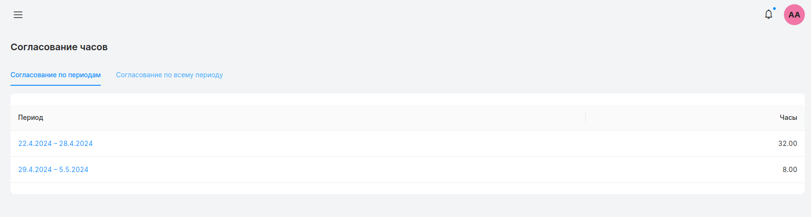

Нажатие на период откроет список проектов зарегистрированных за этот период и доступных пользователю.

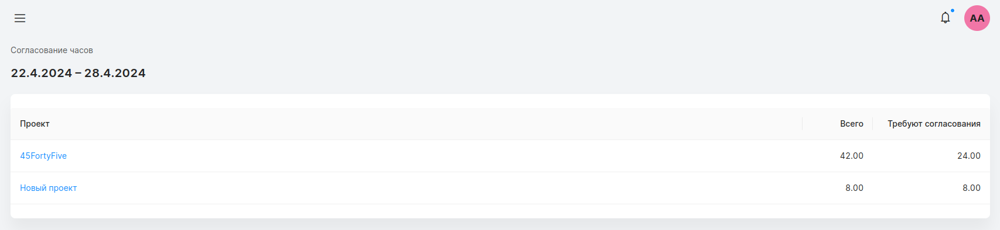

Нажатие на проект открывает страницу, где в табличном виде представлены все часы зарегистрированные за выбранный период. В левом верхнем углу над названием проекта отображается период.
Строка таблицы содержит: имя сотрудника, задачу выполняемую на выбранном проекте, количество зарегистрированных часов, признак оплачиваемости заказчиком задачи, дату к которой прикреплены часы, комментарий сотрудника и элемент согласования/отказа часов.

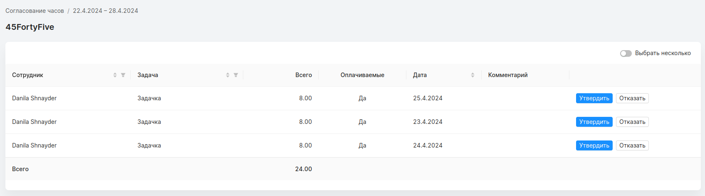

#### Сортировка и фильтрация

Для полей *“сотрудник”*, *“задача”* и *“дата”* доступна сортировка. Одновременно можно использовать все три поля для сортировки.
Столбцы *“сотрудник”* и *“задача”* можно отфильтровать по названию. Иконка фильтрации (в виде воронки) расположена справа от названия колонки. При нажатии, появляется список доступных сотрудников/задач для пользователя.

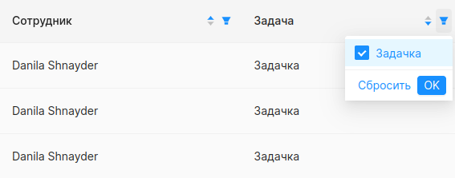

### Согласование зарегистрированного времени за день

При нажатии “утвердить” в строке таблицы, открывается окно подтверждения, где указана информация о согласуемой задачи и времени за день.

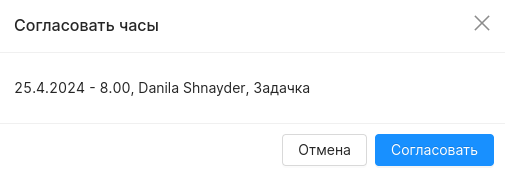

### Отказ зарегистрированного времени за день

Менеджер может посчитать зарегистрированное время некорректным и отклонить его. При нажатии “отказать” в строке таблицы, открывается модальное окно. В этом окне представлена информация об отказываемой задачи и времени за день.

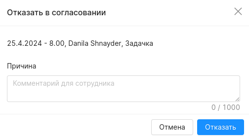

Чтобы сотрудник исправил недочет, менеджер может указать причину отказа. При отказе запись в таблице элементы “согласовать/отказать” изменяются на “отказано”, при обновлении страница запись пропадает.

При успешном отказе также появляется сообщение.

### Работа с несколькими строками

В правой верхнем углу таблицы можно включить выбор сразу нескольких часов для согласования/отказа. При включении флага в таблице появится новый столбец, где можно выбрать строку. Выбранная строка выделяется светло синим цветом. Нажатие на элемент выбора строки в шапке таблицы добавит в выбранные строки всю таблицу. Повторное нажатие сбросит выбор всех строк.

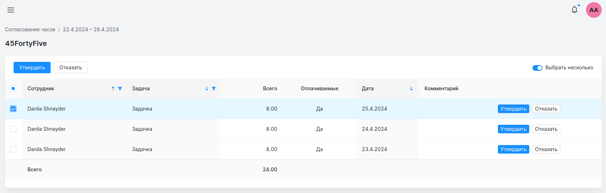

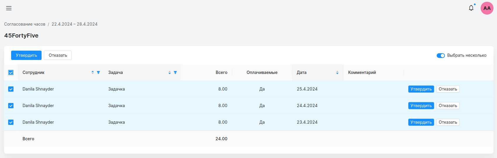

При нажатии на *“утвердить”* в шапке таблицы, на согласование отправляются все выделенные записи.

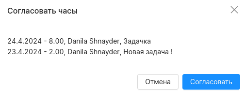

При нажатии на *“отказать”* в шапке таблицы, отменяются все выделенные записи. Сообщение причины отказа распространяются на все отклоняемые часы.

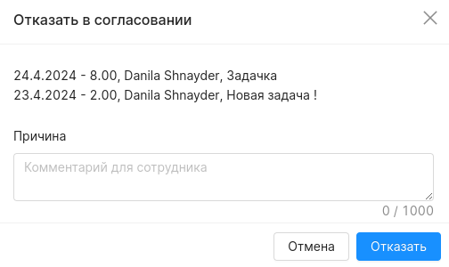

### Согласование часов за выбранный период

На странице согласования часов за выбранный период, все зарегистрированные часы сгруппированы по сотруднику. При нажатии на стрелку возле имени сотрудника, под ним появляются все задачи зарегистрированные за выбранный период.

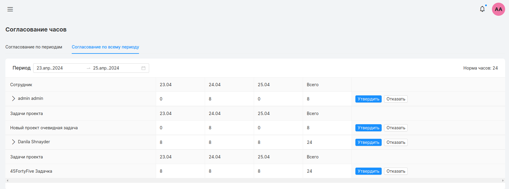

Период можно изменить при помощи элемента в левом верхнем углу таблицы.

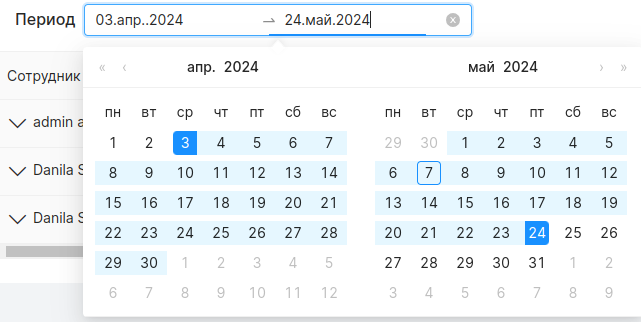

### Согласование зарегистрированного времени за период

При нажатии на кнопку *“утвердить”* в строке с именем сотрудника, на подтверждение выбираются все зарегистрированные часы за этот период по всем его задачам.

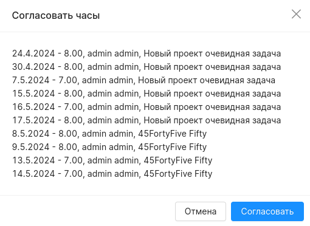

При нажатии на кнопку “утвердить” в строке задачи проекта, на подтверждение выбираются все зарегистрированные часы за этот период по этой задаче.

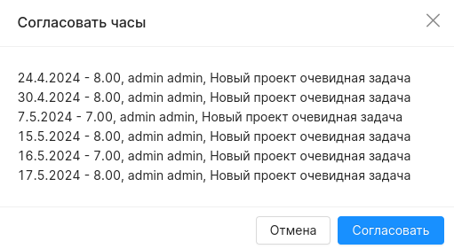

### Отказ зарегистрированного времени за период

При нажатии на кнопку *“отказ”* в строке сотрудника, для отказа выбираются все зарегистрированные часы по всем задачам за этот период.

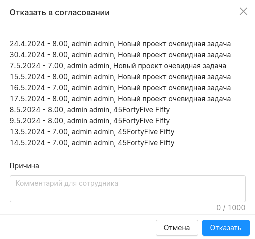

При нажатии на кнопку “отказ” в строке задачи проекта, для отказа выбираются все зарегистрированные часы за этот период по этой задаче.

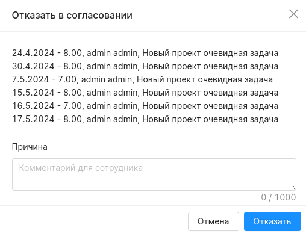
