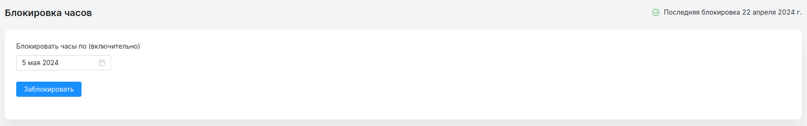
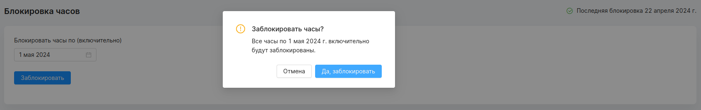

## Страница блокировки
#### Доступ
Администратор.
***

Блокировка часов - это процесс завершения регистрации часов за период. Дни попавшие в блокируемый период больше нельзя изменять. Администратор вручную выбирает дату блокировки, которая не может быть больше текущего дня.

При нажатии на кнопку заблокировать, откроется окно подтверждения.

При подтверждении блокировки, часы по указанную в блокировке дату становятся недоступными для редактирования и регистрации.
