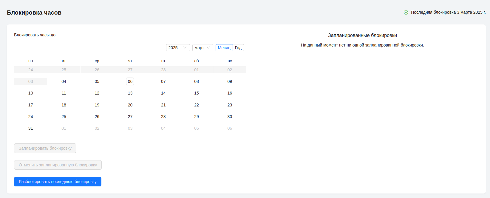
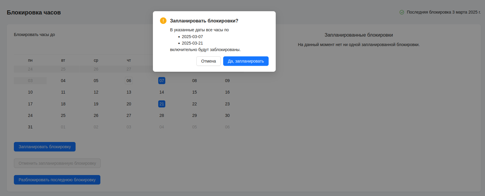
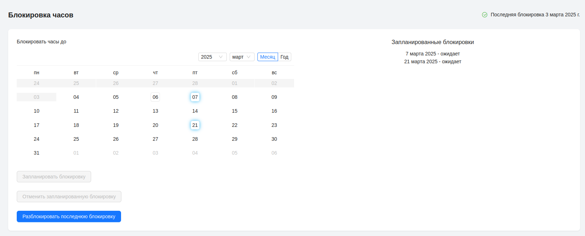
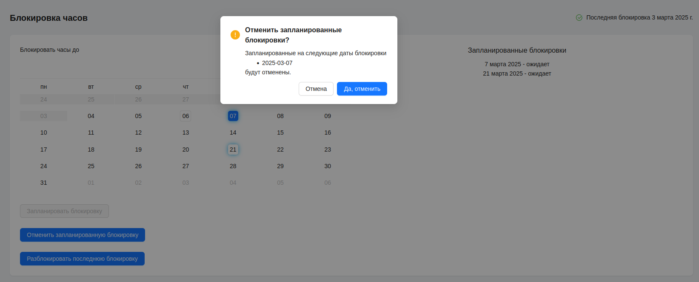

## Страница блокировки
#### Доступ
Администратор.
***

Блокировка часов - это процесс завершения регистрации часов за период. Дни, попавшие в блокируемый период, больше нельзя изменять. Администратор вручную выбирает дату блокировки, которая не может быть раньше уже заблокированной даты.

В календаре можно выбрать несколько дат и затем нажать на кнопку "Запланировать блокировку", откроется окно подтверждения.

После подтверждения даты попадут в список запланированных блокировок. В эти даты будет выполнена блокировка и все часы по указанную в блокировке дату становятся недоступными для редактирования и регистрации.

Возможно запланировать дату блокировки на уже прошедший день. В этом случае запланированная блокировка будет сразу же выполнена, и все часы по указанную дату станут недоступными для редактирования и регистрации.

Возможно удалить дату из списка запланированных блокировок выделив ее в календаре и нажав на кнопку "отменить запланированную блокировку". После подтверждения дата будет удалена из списка запланированных блокировок.

Возможно отменить одну последнюю выполненную блокировку нажав на кнопку "Разблокировать последнюю блокировку". После подтверждения действия часы, заблокированные в тот период, снова станут доступными для редактирования и регистрации
