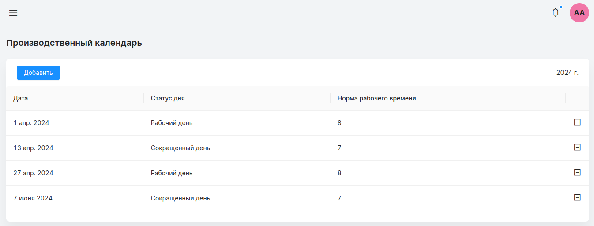
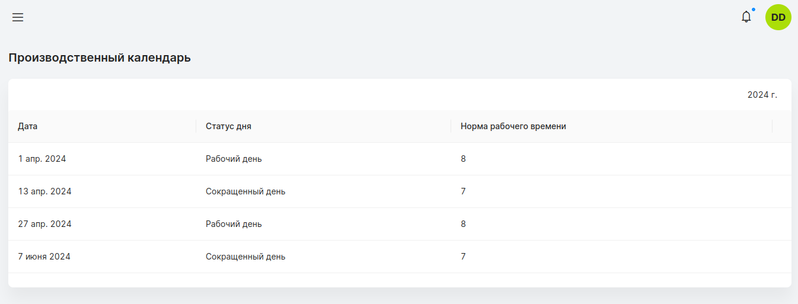
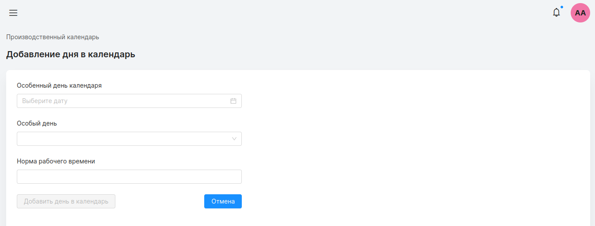
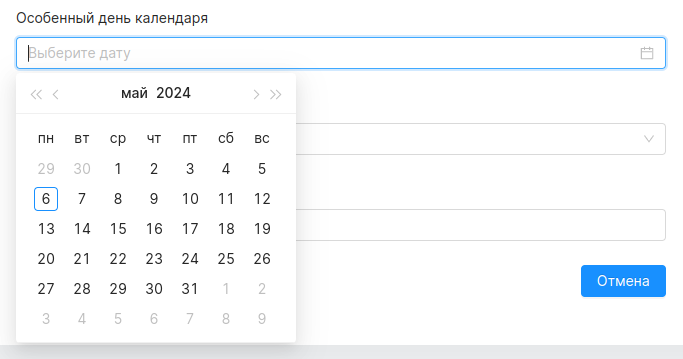
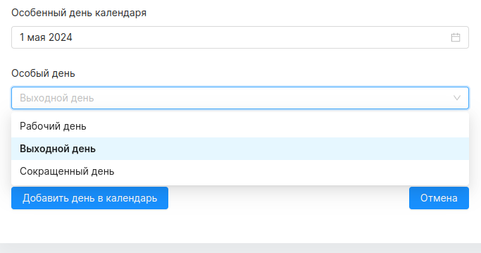
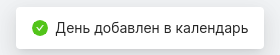
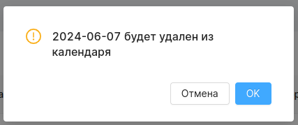
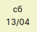
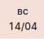
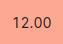

## Производственный календарь
#### Доступ
Просмотр: все
Редактирование: администратор
***

На странице отображается список особенных дат в календаре за текущий год. Особенные даты - выходной, рабочий день в выходной, сокращенный день. Даты добавленные в производственный календарь используются для [цветового обозначения](#color). Добавление/удаление дат происходит в ручном режиме администратором.

страница производственного календаря для администратора

страница производственного календаря для других пользователей

### Добавление дня в производственный календарь

При нажатии на *“добавить”* в левом верхнем углу экрана производственного календаря, администратор перенаправляется на страницу добавления.

Для добавления дня в производственный календарь администратор должен выбрать дату.

Выбрать статус для сохраняемой даты.

Если выбраны статусы *“выходной день”* или *“рабочий день”*, поле норма рабочего времени недоступно для редактирования. При выборе статуса *“сокращенный день”* автоматически устанавливается значение 7, но его можно изменить.
При успешном добавлении в календарь, появится сообщение об успехе и день будет отображен в таблице.

### Удаление дня из календаря

Нажатие на знак удаления (минус) откроет подтверждающее модальное окно.
При нажатии “ок” день будет удален из производственного календаря.

### Цветовые обозначения

В Timetracker применяется цветовая маркировка дней:

|  |   |
|------------|---|
| Сокращенный день (рабочая норма часов меньше 8 часов)||
| Выходной день||
| Переработка (Если часов зарегистрировано больше рабочей нормы)            | |

