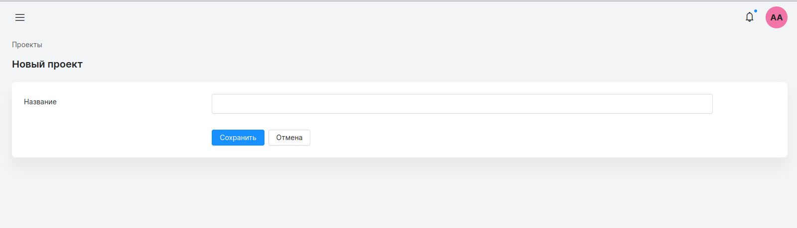

## Страница создания проекта

#### Доступ: администратор.

Страница создания проекта представляет собой форму из одного поля с названием.
Чтобы добавить новый проект, необходимо заполнить поле **“название”** и нажать кнопку сохранить.

Нажатие на кнопку “отмена” вернет администратора на страницу проектов.

Нажатие на кнопку **“сохранить”** запустит процесс добавления проекта. При добавлении проекта, название проверяется по [правилам заполнения проекта](./fill_rules.md). Если хотя бы одно условие, не будет соблюдено, проект не будет сохранен. Пользователю отобразится сообщение об ошибке.

При успешном сохранении, администратора вернет на страницу проектов, и будет выведено уведомление об успехе.

#### Архивирование проекта
Администратору доступно архивирование проекта. Архивирование проекта означает, что сотрудники не смогут выбрать этот проект для регистрирования новых часов. Напротив названия каждого проекта расположена иконка **“коробки” - “архивирования”**.

Нажатие на иконку открывает окно подтверждения. Кнопка **“ок”** запускает процесс архивации проекта.

Если проект имеет зарегистрированные часы, которые не были согласованы его невозможно отправить в архив.

Если проект будет добавлен в архив, сверху появится уведомление об успехе.
Теперь проект можно найти только при установленном флаге **“архив”**.

