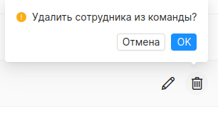

## Страница сотрудников
#### Доступ
Администратор.
***

На странице собран функционал для управления сотрудниками. В центре экрана представлен список всех пользователей зарегистрированных в Timetracker. В строке таблице отображены: имя сотрудника, эл. почта и роль пользователя в Timetracker.
Нажатие на имя пользователя откроет профиль сотрудника для [редактирования](#employee_edit).

#### Фильтрация и сортировка
Для быстрого поиска страница сотрудников поддерживает сортировку по имени и электронной почте. Изменить порядок можно нажатием на *“имя”* или *“Эл. почта”*, расположенных в шапке таблицы. Одновременно может использоваться только один критерий сортировки.
Также при помощи поисковой строки расположенной в левой верхней части страницы сотрудников, можно найти нужного пользователя по его имени. Правее от поисковой строки можно установить флаг *“архив”*, что приведет к поиску по архивированным записям.

### Добавление и редактирование профиля сотрудника
Администратор может добавлять новых сотрудников в систему и редактировать старых. Кнопка *“добавить”* расположена напротив названия страницы - *“Сотрудники”*. Нажатие на нее переводит администратора на страницу добавления сотрудника.

Страница добавления сотрудника представляет собой форму с полями: имя, фамилия электронная почта, [должность](./job_titles_page.md) и роль пользователя в системе Timetracker. Также администратор может установить пароль пользователю в соответствии с правилами заполнения пароля, который сразу можно использовать в системе. В обоих случаях, на указанную электронную почту сотрудника поступит сообщение с ссылкой для изменения пароля.
Страница редактирования представляет собой аналогичную форму. Единственное отличие поля формы заполнены данными изменяемого пользователя. Процесс редактирования профиля сотрудника идентичен процессу добавления поэтому рассмотрим только его.

##### добавление нового сотрудника

##### редактирование сотрудника

Нажатие на кнопку *“отмена”* вернет администратора на страницу сотрудников.
Нажатие на кнопки *“сохранить”* или *“сохранить и добавить в проекты”* запустит процесс сохранения пользователя в системе. Форма проверяется по [правилу заполнения профиля сотрудника](./fill_rules.md). Если хотя бы одно условие, не будет соблюдено, сотрудник не будет сохранен. Пользователю отобразится сообщение об ошибке.
Нажатие на кнопку *“сохранить и добавить в проекты”* после сохранения сотрудника в системе перенаправит администратора на страницу добавления сотрудника в проект.

При успешном сохранении, администратора вернет на страницу сотрудников, и будет выведено уведомление об успехе.

### Архивирование

Сотрудника можно отправить в архив нажатием на иконку архивации (коробка).
Заархивированный сотрудник не может авторизоваться в Timetracker и не может быть добавлен в команды проектов.

Сотрудник не может быть отправлен в архив, если он имеет хотя бы один зарегистрированный час.

При успешной архивации, пользователю отобразится сообщение об успехе, а сотрудника можно найти только при установленном флаге *“архив”*.

### Разархивирование

Сотрудников добавленных в архив можно возвращать в систему Timetracker. Для этого необходимо установить флаг *“архив”* и в строке таблицы нажать на символ разархивирования (коробка со стрелкой вверх).

При успехе сотрудник снова сможет пользоваться системой Timetracker. Администратор получит уведомление об успехе.

### Добавление сотрудника в проект

На страницу можно попасть при добавлении нового пользователя нажатием кнопки *“сохранить и добавить в проекты”* вместо *“сохранить”*, или при помощи элемента переключения между профилем и проектами на странице редактирования сотрудника в левом верхнем углу. В строке таблицы отображены: название проекта, роль и ставка сотрудника на проекте.

При нажатии на кнопку *“Добавить в проект”* отобразится модальное окно.

Поле *“проект”* заполняется при помощи клавиатуры. По введенному значению отображаются проекты, у которых есть совпадение с введенными символами. Если сотрудник уже добавлен на проект, то он будет недоступен для выбора.
Чтобы прикрепить сотрудника к проекту, необходимо выбрать его из выпадающего списка, иначе поле останется пустым.

При добавлении сотрудника ему назначается роль: пользователь и менеджер. Также назначается ставка, которая не может быть отрицательной.
Если не заполнить поля *“сотрудник”* и *“ставка”* пользователь получит сообщение об ошибке под каждым полем.

При успешном добавлении сотрудника в проект, пользователю отобразится сообщение об успехе и проект отобразится в списке.

#### Работа с элементом таблицы

В правой стороне строки представлены элементы управления: *“редактирование”* и *“удаление из команды”*.

#### Редактирование

Нажатие на иконку редактирования (карандаш) делает строку таблицы редактируемой. Пользователь может изменить роль сотрудника и ставку на проекте. А элементы управления изменяются на подтверждения/отмену редактирования.

#### Удаление из команды

Сотрудника можно удалить из команды нажатием на иконку удаления (корзина).

При успешном удалении, проект будет удален из списка проектов сотрудника.
