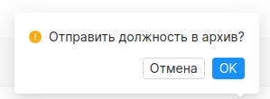

## Страница должностей
#### Доступ
Администратор
***
На странице представлен функционал для управления должностями на проекте. Должность, понимается как специализация сотрудника. Например, java-разработчик.
В центре страницы отображается список всех должностей в проекте. В строке таблицы представлена информация о названии должности, ставке в компании, элементы управления. При нажатии на название администратора перенаправляет на [страницу редактирования этой должности](#job_edit).

#### Фильтрация и сортировка
Для быстрого поиска страница должностей поддерживает сортировку по названию. Изменить порядок можно нажатием на “название”, расположенная в шапке таблицы. Также при помощи поисковой строки расположенной в левой верхней части страницы должностей, их можно найти по названию. Правее от поисковой строки можно установить флаг “архив”, что приведет к поиску по архивированным записям.

### Добавление и редактирование должности

Администратор может добавлять новые должности в систему и редактировать старые. Кнопка *“добавить”* расположена напротив названия страницы - *“Должности”*. Нажатие на нее переводит администратора на страницу добавления должности.

Страница добавления должности  представляет собой форму из двух полей: ставка и название. Страница редактирования представляет собой аналогичную форму. Единственное отличие поля формы заполнены данными изменяемой должности. Процесс редактирования должности идентичен процессу добавления поэтому рассмотрим только его.

##### добавление новой должности

##### редактирование должности

Нажатие на кнопку *“отмена”* вернет администратора на страницу должностей.
Нажатие на кнопку *“сохранить”* запустит процесс сохранения должности в системе. При добавлении новой должности, форма проверяется по [правилам заполнения должности](./fill_rules.md). Если хотя бы одно условие, не будет соблюдено, должность не будет сохранена. Пользователю отобразится сообщение об ошибке.

При успешном сохранении, администратора вернет на страницу должностей, и будет выведено уведомление об успехе.

### Архивирование

Должность можно отправить в архив нажатием на иконку архивации (коробка).

Должность не может быть отправлена в архив, если она назначена хотя бы одному сотруднику.

При успешной архивации, пользователю отобразится сообщение об успехе.

