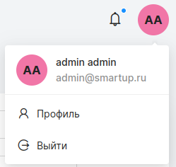
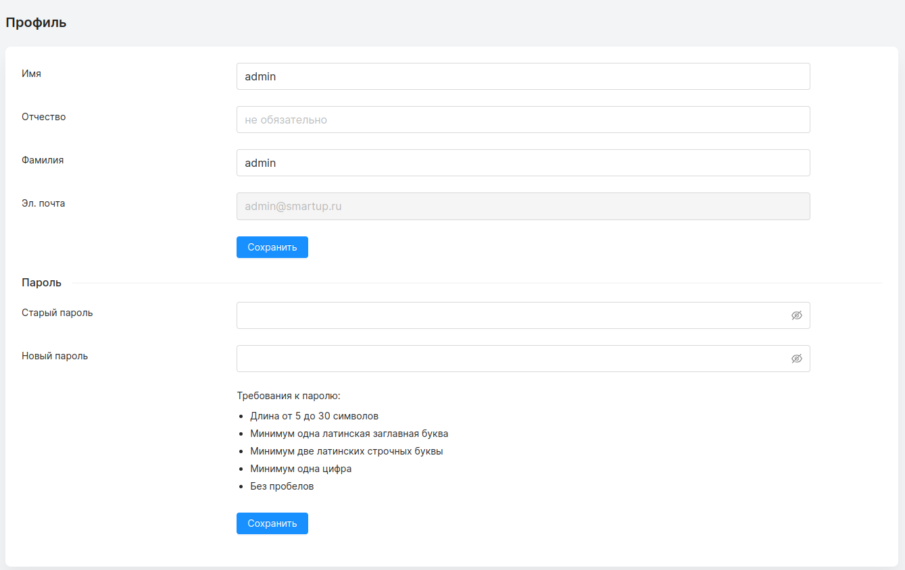

## Страница профиля

На страницу профиля можно попасть при помощи нажатия на круг с инициалами в правом верхнем углу экрана. В выпадающем списке необходимо выбрать “профиль”.

На странице профиля сотрудник может изменять свои имя и фамилию в соответствии с [правилами заполнения профиля](./fill_rules.md). Изменение адреса эл. почты доступно только администратору через [страницу сотрудников](./employees_page.md).
Также пользователь может изменить свой пароль в соответствии с [требованиями к паролю](./fill_rules.md).

