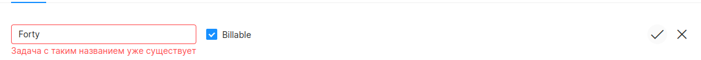
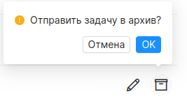

## Страница проекта
#### Доступ
Менеджер, администратор.
***
На странице проекта представлен функционал для управления проектом, его задачами и командой.

#### Список всех задач проекта

#### Команда проекта

### Редактирование проекта

В левом верхнем углу экрана проекта отображена дата создания проекта и его название. В противоположной стороне экрана расположена кнопка **“редактировать”**. При нажатии, пользователь откроет форму где можно изменить название проекта. При изменении проекта, название проверяется по [правилам заполнения проекта](./fill_rules.md). Если хотя бы одно условие, не будет соблюдено, проект не будет обновлен. Пользователю отобразится сообщение об ошибке.

### Переключение между задачами и командой

В центре страницы в табличном виде отображен список задач или команды проекта. Чтобы переключаться между ними, в шапке таблицы слева, необходимо выбрать соответствующее название. Активный элемент, выделяется голубым цветом. В зависимости от выбранной категории, изменяется не только список отображаемых элементов, но и кнопка добавления элемента, расположенная в шапке таблицы справа.

### Добавление задачи

При нажатии на кнопку **“Создать задачу”** отобразится модальное окно, где пользователь должен ввести название задачи в соответствии с [правилами заполнения задачи проекта](./fill_rules.md). Если хотя бы одно условие, не будет соблюдено, задача  не будет добавлена. Пользователю отобразится сообщение об ошибке.
Также при добавлении новой задачи, пользователь может установить флаг **“Billiable”**, обозначающий что задача оплачивается заказчиком.

При успешном сохранении задачи в проект, пользователю отобразится сообщение об успехе.

### Работа с элементом таблицы

В строке таблицы отображено название задачи, признак оплачиваемой/неоплачиваемой задачи. В правой стороне строки представлены элементы управления: **“редактирование”** и **“архивирование”**.

### Редактирование

Нажатие на иконку редактирования (карандаш) делает строку таблицы редактируемой. Пользователь может изменить название и признак оплачиваемой/неоплачиваемой. А элементы управления изменяются на подтверждения/отмену редактирования.

Пользователь должен ввести название задачи в соответствии с [правилами заполнения задачи проекта](./fill_rules.md). Если хотя бы одно условие, не будет соблюдено, задача  не обновлена. Пользователю отобразится сообщение об ошибке.

### Архивирование

Задачу можно отправить в архив нажатием на иконку архивации (коробка).

Задача не может быть отправлена в архив, если имеет хотя бы один зарегистрированный час.

При успешной архивации, пользователю отобразится сообщение об успехе.

Заархивированная задача отображается в общем списке задач, но не имеет элементов управления.

### Добавление в команду

При нажатии на кнопку **“Добавить в команду”** отобразится модальное окно.

Поле **“сотрудник”** заполняется при помощи клавиатуры. По введенному значению отображаются сотрудники, у которых есть совпадение в имени или фамилии. Если сотрудник уже добавлен на проект, то он не отобразится в списке.
Чтобы добавить сотрудника на проект, необходимо выбрать его из выпадающего списка, иначе поле останется пустым. И администратор и менеджер могут добавить любого сотрудника.

При добавлении сотрудника ему назначается роль: пользователь и менеджер. Также назначается ставка, которая не может быть отрицательной.
Если не заполнить поля **“сотрудник”** и **“ставка”** пользователь получит сообщение об ошибке под каждым полем.

При успешном добавлении сотрудника в проект, пользователю отобразится сообщение об успехе и сотрудник отобразится в списке.

### Работа с элементом таблицы команды

В строке таблицы отображены имя сотрудника, его роль и ставка на проекте. В правой стороне строки представлены элементы управления: **“редактирование”** и **“удаление из команды”**.

#### Редактирование

Нажатие на иконку редактирования (карандаш) делает строку таблицы редактируемой. Пользователь может изменить роль сотрудника и ставку на проекте. А элементы управления изменяются на подтверждения/отмену редактирования.

#### Удаление из команды

Сотрудника можно удалить из команды нажатием на иконку удаления (корзина).

При успешном удалении, сотрудник пропадет из команды.

