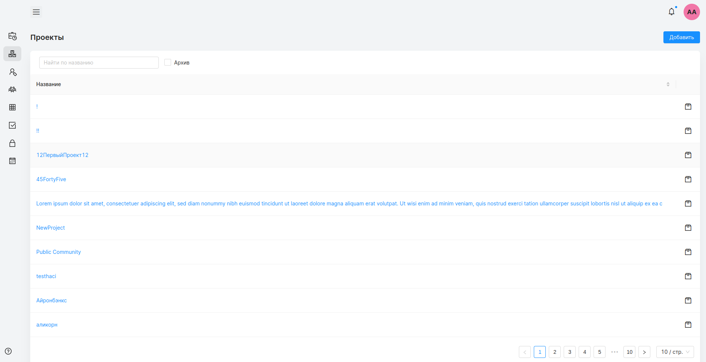
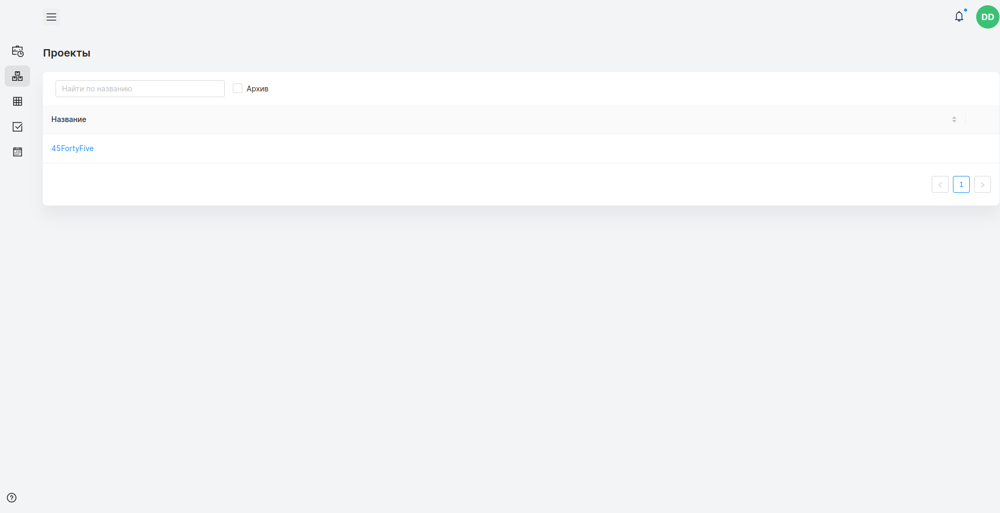
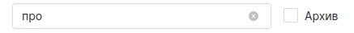
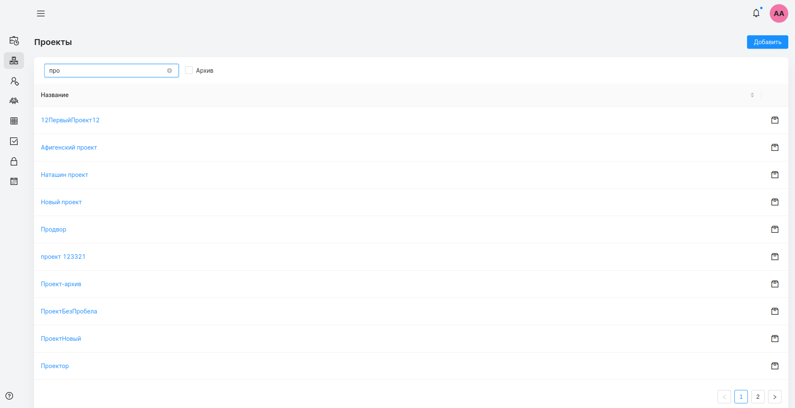

## Страница проектов
#### Доступ
Менеджер, администратор.
***
На странице проектов отображаются все проекты, доступные пользователю.
Нажатие на название конкретного проекта открывает [страницу проекта](##Cтраница проекта).
##### администратор

##### менеджер

#### Фильтрация и сортировка
Для быстрого поиска проекты поддерживают фильтрацию и сортировку. Изменить порядок можно нажатием на “название”, расположенной над списком проектов. Также при помощи поисковой строки расположенной в левой верхней части страницы проектов, можно найти нужный проект по названию. Правее от поисковой строки можно установить флаг “архив”, что приведет к поиску по архивированным проектам.

Таблица проектов разделена на страницы. Подробно про переключение между страницами таблицы можно прочитать в разделе ["Элемент пагинации таблицы"](###Элемент пагинации таблицы).
##### Менеджер
Менеджер имеет доступ только к тем проектом, на которых он указан в роли менеджера.
##### Администратор
Администратор имеет расширенный функционал. Ему доступен список всех проектов зарегистрированных в системе.

##### Создание проекта
Администратор может добавлять новые проекты в систему. Кнопка “добавить” расположена напротив названия страницы - “Проекты”. Нажатие на нее переводит администратора на страницу создания проекта.
