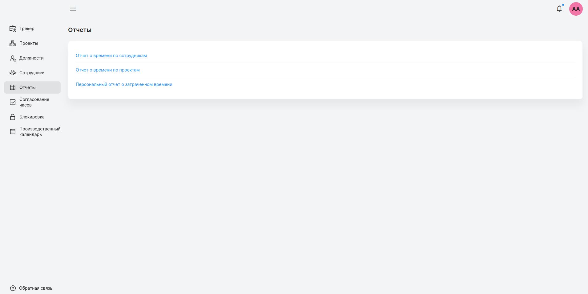
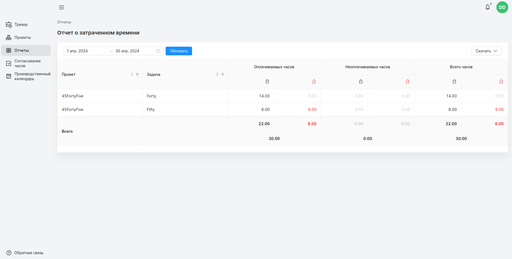
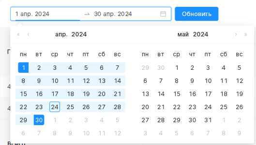
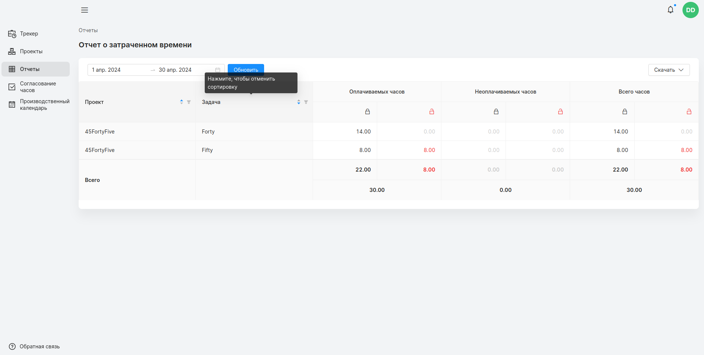
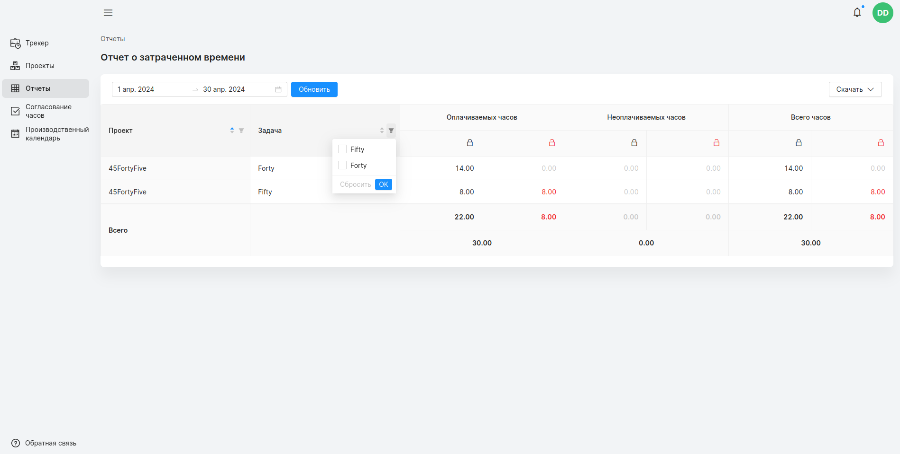
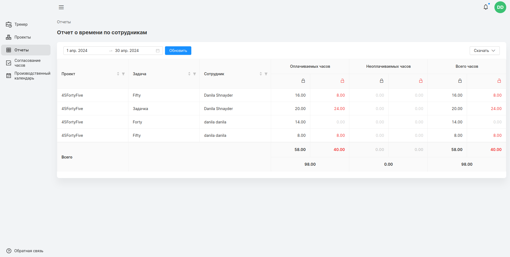
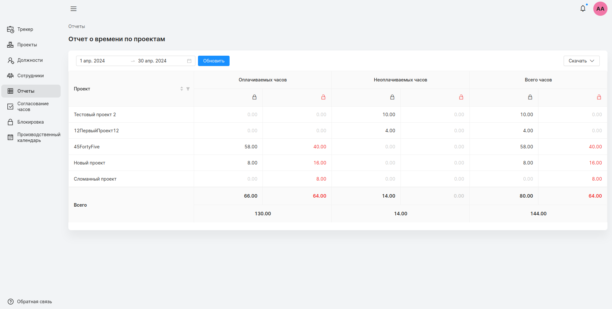

## Страница отчетов
#### Доступ
Пользователь Timetracker, менеджер, администратор, пользователь для просмотра отчета. 
***
На странице отчетов пользователю в зависимости от его роли в Timetracker доступны различные отчеты.

Каждый отчет представляет из себя сумму зарегистрированных (согласованных и несогласованных) часов сгруппированных по полям за указанный период. На примере персонального отчета рассмотрим общий функционал, для каждого отчета.

#### Переключение периода
Период отображается в левом верхнем углу отчета. Пользователь может изменить период при помощи календаря. После, для загрузки данных за указанный период необходимо нажать обновить.

#### Цветовые обозначения
На странице красным цветом выделены незаблокированные часы.
#### Фильтрация и сортировка столбцов
Для быстрого поиска столбцы поддерживают фильтрацию и сортировку. Изменить сортировку можно нажатием на шапку колонки, которая содержит в себе иконку сортировки (два треугольника напротив названия).

Столбцы можно отфильтровать по названию. Иконка фильтрации (в виде воронки) расположена справа от названия колонки. При нажатии, появляется список доступных проектов/задач для пользователя.

#### Персональный отчет
#### Доступ
пользователь Timetracker, менеджер проекта, администратор
***
В персональном отчете отражена информация о всем зарегистрированном сотрудником времени (согласованным и несогласованным) за указанный период, сгруппированным по задачам.

#### Отчет о времени по сотрудникам
#### Доступ 
к отчету по сотрудникам имеют: пользователь для просмотра отчета, менеджер проекта, администратор.
***
На странице отображена информация, аналогичная 
[персональному отчету](####Персональный отчет). Помимо проектов и задач, часы сгруппированы по дополнительному столбцу: сотрудник. Для столбца “сотрудник” также предусмотрена сортировка и фильтрация.

##### Менеджер
Менеджер имеет доступ к часам сотрудников зарегистрированных на его проектах.
##### Пользователь для просмотра отчетов
Пользователь для просмотра отчета имеет доступ ко всем зарегистрированным часам сотрудников со всех проектов.
##### Администратор
Администратор имеет доступ ко всем зарегистрированным часам сотрудников со всех проектов.

#### Отчет о времени по проектам
#### Доступ 
менеджер, пользователь для просмотра отчетов, администратор.
***
Здесь отображены суммарные часы зарегистрированного времени всех сотрудников сгруппированные по проекту за указанный период. На отчете доступна фильтрация и сортировка по проекту.

##### Менеджер
Менеджер имеет доступ к часам зарегистрированных на его проектах.
##### Пользователь для просмотра отчетов
Пользователь для просмотра отчета имеет доступ ко всем зарегистрированным часам на всех проектах.
##### Администратор
Администратор имеет доступ ко всем зарегистрированным часам на всех проектах.