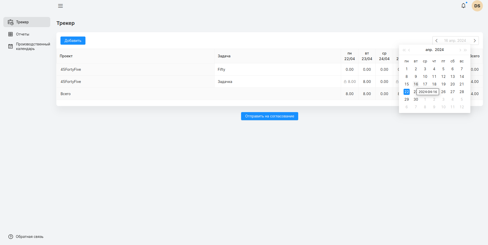

## Страница трекера
### Трекинг часов
#### Доступ
Пользователь, менеджер, администратор.
***
На странице трекинга времени пользователи могут быстро (в табличном виде) регистрировать отработанные часы. Данная функция доступна для всех пользователей, но пользователь должен быть закреплен хотя бы за одним проектом.  На странице используется цветовое обозначение дней.

При нажатии кнопки “Добавить” в левом верхнем углу экрана трекера, в таблице создается новая строка. Пользователь может выбрать проект в ручную в выпадающем меню доступных ему проектов, либо ввести название проекта с клавиатуры. После этого шага, аналогичным способом необходимо определить задачу с выбранного проекта.

1.  Всякая запись времени относится к пользователю, проекту и задаче
2.  У записи времени может быть комментарий
3.  Запись может быть оплачиваемой или неоплачиваемой клиентом
4.  Новую запись можно создавать на тот же день, проект, задачу
#### Действие над задачей проекта
1.  Задачу можно “запомнить”, то есть сохранять выбор задачи при перелистывании недели. Запоминание применяется автоматически. Чтобы убрать запоминание с задачи, необходимо нажать “запомнить”, после  “сохранить”.
2.  Удалить все записи задачи за неделю. Удаление записей за неделю, так же уберет задачу из запоминания.
3.  Отменить действия над задачей за неделю.

#### Переключение недели
Переключение на следующую неделю осуществляется при помощи календаря, в правой части трекера.

Переключить на другую неделю можно выбрав любой день этой недели в календаре, или нажатием стрелки соответствующей стрелки (вперед/назад).
#### Согласование часов
При сохранении часов, отображается кнопка “Отправить на согласование”. Нажатие откроет модальное окно, где часы сгруппированы по неделе. Выбрав необходимые часы, пользователь может отправить их на согласование менеджерам проектов. После “отправки” часы изменить нельзя.

#### Отклоненные часы
Администратор или менеджеры проектов могут отклонить часы пользователя, указав причину. Отклоненные часы можно редактировать снова. В трекере, время которое было отклонено отмечено восклицательным знаком.

При нажатии на ячейку отклоненной задачи пользователь может увидеть причину отказа. Отклоненные часы можно повторно отправить на согласование.

#### Дополнительный функционал администратора и менеджера проекта
Менеджер проекта, может трекать не только свои часы, но и часы сотрудников проекта. Сменить пользователя можно в выпадающем списке справа. Администратор имеет доступ к часам всех пользователей.
